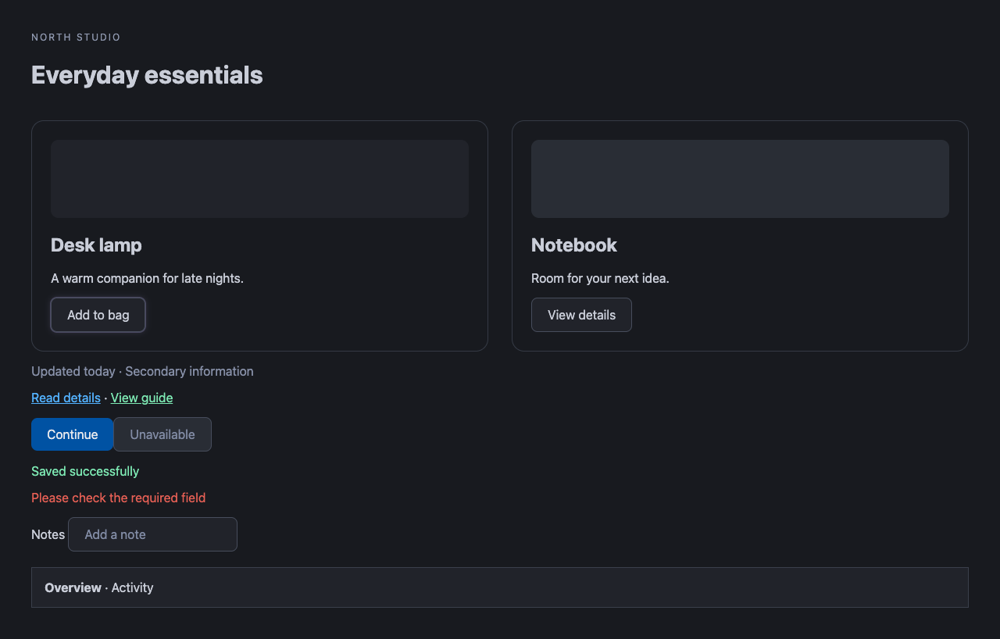

<div align="center">
  
  <h1>Afterglow</h1>
  <p>A quieter, darker web—without losing what makes each website unique.</p>
  <p><strong>Chrome Extension · Manifest V3 · TypeScript · Dark Reader · Playwright</strong></p>
</div>

Afterglow brings a comfortable charcoal theme to light websites, preserves existing dark designs, and keeps photos, videos, and canvas content in their original colors. Built as a locally installable Chrome extension, it combines automatic theme detection with simple controls and preferences that stay on your computer.

**Current version:** 0.1.11 · **Distribution:** unpacked extension; Chrome Web Store publication is not included.

## Preview



*A local browser fixture showing charcoal surfaces, adapted website colors, softer secondary text, and clear form controls.*

## Features

- **Automatic dark mode:** themes light pages and steps aside when a native dark theme is detected, including changes made while a page is open.
- **Website identity preserved:** adapts original link, button, and status colors while retaining layout, typography, and meaningful visual distinctions.
- **Media stays natural:** avoids whole-page inversion and image filtering; photos, videos, canvas, and background images retain their colors.
- **Simple appearance controls:** choose Automatic or Original site for each hostname, or pause Afterglow globally without losing preferences.
- **Immediate updates:** settings apply across open tabs for the same website and eligible embedded frames.
- **Automatic tab recovery:** reconnects after extension reloads without navigating pages or clearing unsaved drafts.
- **Local preferences:** no account, analytics, settings sync, or Afterglow backend.

## Design approach

Afterglow uses charcoal `#181A1F` and soft off-white `#E6E8ED` as its theme baseline. Dark Reader's dynamic engine adapts the website's existing colors, maintaining differences between surfaces, form fields, primary text, and secondary information.

Lavender `#B9AEF5` appears in the extension's branding. Page styling preserves the website's own interaction treatments. Native dark websites remain untouched.

## Engineering highlights

| Area | Implementation |
| --- | --- |
| Theme detection | Nine viewport samples resolve transparent and translucent background layers, exclude media colors, and compare visible text against page surfaces. Unrendered pages defer classification. |
| Dynamic pages | Debounced DOM, stylesheet, and theme-attribute changes trigger reevaluation without continuous polling. Afterglow removes its own theme before measuring original colors. |
| Settings | `chrome.storage.local` stores global preferences and exact-hostname overrides. Paths share settings; subdomains remain independent. Frames follow the top-level site's preference. |
| Lifecycle | A background service worker coordinates settings, page status, and recovery. Content-script disposal and duplicate-injection guards handle extension reloads. |
| Packaging | esbuild bundles executable code locally. Dark Reader is pinned to 4.9.133, with attribution included in the built extension. |

## Getting started

Requires **Node.js 22+** and **desktop Chrome 120+**.

```sh
git clone https://github.com/JamesonCodes/afterglow.git
cd afterglow
npm ci
npm run build
```

The build creates a loadable `dist/` directory.

1. Open `chrome://extensions` in Chrome.
2. Enable **Developer mode**.
3. Select **Load unpacked** and choose this repository's `dist` folder.
4. Pin Afterglow from the Extensions menu.

Existing eligible tabs connect automatically. After making changes, rebuild and reload the extension from `chrome://extensions`.

### Using Afterglow

| Control | Behavior |
| --- | --- |
| Afterglow across the web | Enables or pauses the extension globally, preserving saved site choices. |
| Automatic | Applies Afterglow to light pages and preserves detected native dark themes. |
| Original site | Restores the website's original appearance for that hostname. |

Changes save immediately. Automatic mode operates independently of your operating system's appearance setting.

## Validation

```sh
npm run check
npm test
npx playwright install chromium
npm run test:browser
```

The browser suite builds the extension and runs it in a disposable Chromium profile. It covers:

- Settings precedence, hostname isolation, legacy preference handling, and persistence across browser restarts.
- Native dark detection, layered backgrounds, delayed styles, theme switching, and dynamic content.
- Popup interactions, forms, embedded frames, media colors, and distinct link and status colors.
- Keyboard operation and removal of retired accent controls and styling.
- Recovery across ten open tabs, retained form drafts, duplicate-injection safety, and invalid-context errors.

Article, shopping, and web-app fixtures generate visual previews in `design-previews/`. To capture an earlier build for comparison, run `AFTERGLOW_DESIGN_BASELINE=1 node tests/browser.mjs` before building the revised theme. This flag changes preview filenames and skips the new color-distinction assertions; it does not alter styling.

## Project structure

```text
src/                 Theme application, detection, settings, and popup logic
public/              Manifest, popup markup/styles, and extension icons
assets/              Brand artwork
tests/              Settings tests and browser fixtures
build.mjs            Local bundling and extension packaging
dist/                Generated unpacked extension (not committed)
```

## Permissions and privacy

| Access | Purpose |
| --- | --- |
| HTTP and HTTPS websites | Automatically style eligible pages and embedded frames. |
| `storage` | Save preferences locally. |
| `scripting` | Reconnect content scripts to existing tabs after installation or reload. |

The background worker can fetch a website's stylesheets when cross-origin rules prevent the theme engine from reading them directly. These brokered requests omit cookies and authentication credentials, require a CSS content type, and enforce a 3 MB streamed response limit and 10-second timeout. The theme engine can also read same-origin stylesheets using normal browser requests. Afterglow has no analytics, account system, cloud settings, remote executable code, or external application backend.

## Compatibility

Chrome internal pages, the Chrome Web Store, and the built-in PDF viewer cannot be themed. Native-dark detection is heuristic; unusual layouts may be misclassified. Select **Original site** when you prefer a website's own appearance.

Closed shadow roots, complex charts, protected embeds, and inaccessible or incorrectly served stylesheets may need individual adjustments. Background images intentionally remain unchanged, so white image backgrounds can still appear bright. Running another dark-mode extension on the same page can cause conflicts.

Dark Reader's inline page proxies are omitted for Manifest V3 compatibility. Consequently, some changes made directly through JavaScript stylesheet APIs may not be observed. Local fixtures cover layouts representative of YouTube and LinkedIn; authenticated live pages still require manual verification.

## Attribution

Afterglow uses the locally bundled **Dark Reader 4.9.133** dynamic theme engine, Copyright Dark Reader Ltd., under the MIT license. See [THIRD_PARTY_LICENSES.txt](THIRD_PARTY_LICENSES.txt); the build also includes a copy in `dist/`.

The build applies compatibility adjustments for Manifest V3 and stale extension messaging without modifying the installed dependency.
